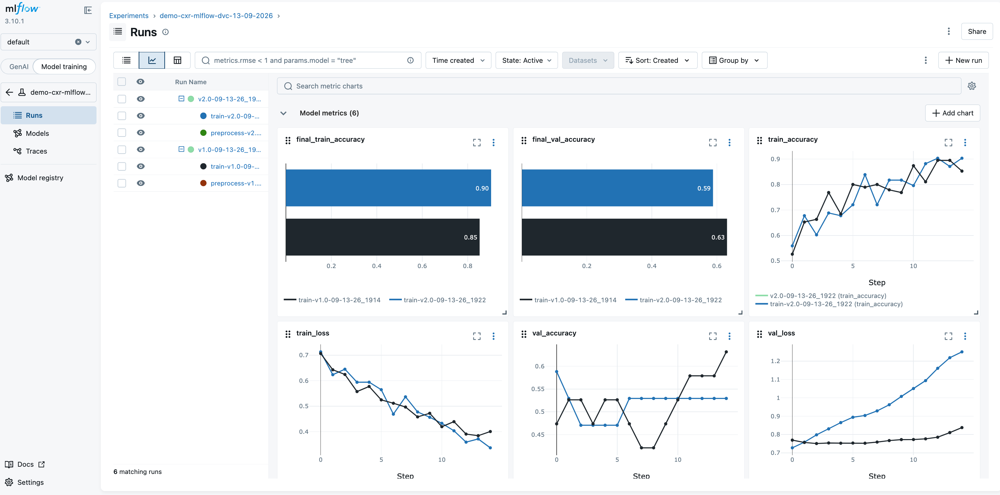
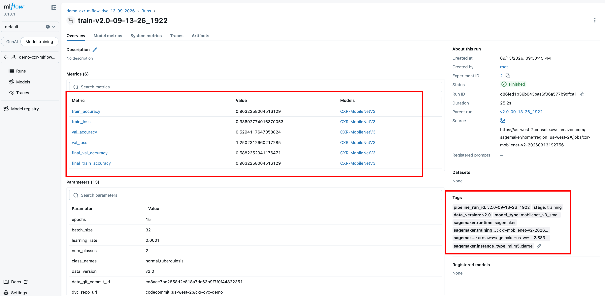
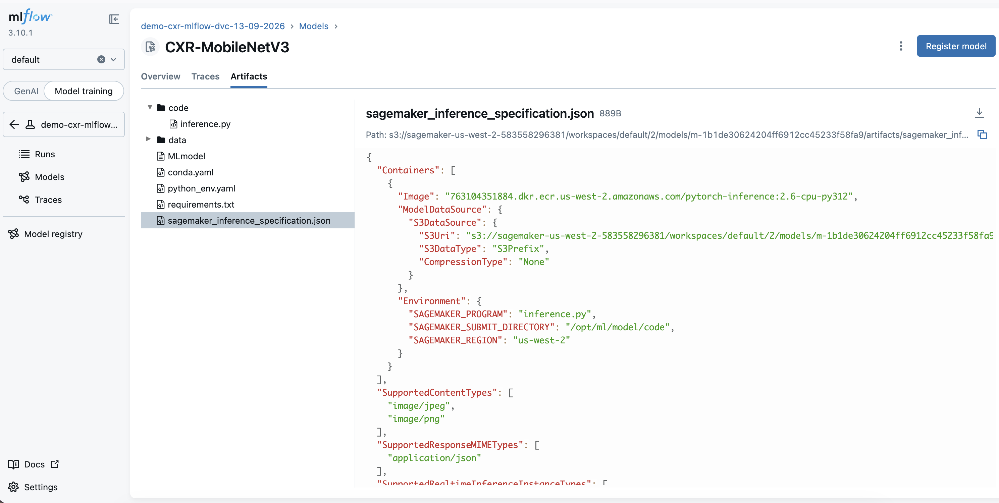
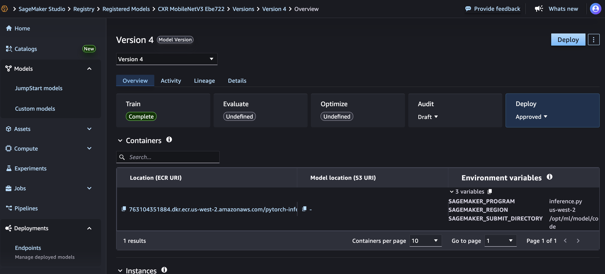

# End-to-End ML Traceability with DVC and MLflow on Amazon SageMaker AI

This sample demonstrates how to integrate [DVC](https://dvc.org/) (Data Version Control) with [MLflow on Amazon SageMaker AI](https://docs.aws.amazon.com/sagemaker/latest/dg/mlflow.html) for data lineage and model tracking. 

Fully managed MLflow on Amazon SageMaker AI makes it easier to track experiments and monitor performance of models and AI applications using a single tool. The workflow uses SageMaker AI Processing and Training jobs to version datasets with DVC and track models with MLflow — enabling full traceability from production models back to the exact data they were trained on.

## Why Data Lineage Matters

In regulated industries and enterprise ML, you need to answer questions like:
- *"Which data was used to train the model currently in production?"*
- *"Was this customer's data included in any of our models?"*
- *"Can we reproduce the exact model we deployed 6 months ago?"*

### How DVC + MLflow Solves This

- Every model in MLflow links to a specific DVC commit hash
- That commit hash points to the exact dataset version in Amazon S3
- You can trace any model back to its training data, identify affected models, and retrain with corrected datasets

This pattern applies to healthcare, autonomous vehicles, e-commerce, content moderation, and any ML team debugging model degradation across data versions.


## Getting Started

This repo includes two notebooks that build on the same architecture. Pick the one that fits your use case:

| Notebook | Description | Key Question It Answers |
|----------|-------------|------------------------|
| **[Foundational](./foundational/foundational_dataset_level_lineage.ipynb)** | **Dataset-level lineage.** Every model links to the exact dataset version (via DVC commit hash) it was trained on. You can reproduce any model's training data with `dvc pull`. However, you don't have structured metadata about which individual records are inside each dataset version — to find out, you'd need to reconstruct the dataset and inspect its contents. | *"Which dataset version trained this model?"* |
| **[Healthcare Compliance](./healthcare-compliance/healthcare_example_record_level_lineage.ipynb)** | **Record-level lineage.** Builds on the foundational pattern by adding a **manifest** — a structured index of every individual record in each dataset version — logged as an MLflow artifact on every training run. This makes individual records queryable without reconstructing the dataset. Combined with a **consent registry** that controls which records enter the pipeline, you can answer audit questions and handle record exclusion requests. | *"Which specific records trained this model, and can I exclude one?"* |

The healthcare notebook uses a CSV as the registry for simplicity, but in production this would be a central database (e.g., a consent management platform or DynamoDB table) that the processing job queries directly.

Both notebooks share the same training script (`source_dir/train.py`) and follow the same architecture, with separate preprocessing scripts for each use case.

Part 4 of the foundational notebook (and Part 9 of the healthcare notebook) puts the same stages together as a single parameterized **SageMaker AI Pipeline**: a `ProcessingStep` that versions the data with DVC, a `TrainingStep` that logs to MLflow, an `@step` quality gate on the validation accuracy, and an `@step` that logs the inference specification and registers the model, producing an approved, deployable Model Package with full lineage per execution. In the healthcare variant the consent registry is a pipeline parameter, so an opt-out is one `pipeline.start()` with the updated registry. All stages of one run (manual or pipeline) are nested under a parent MLflow run named after the `PIPELINE_RUN_ID`.

### Prerequisites

- An AWS Account
- Python 3.11 or 3.12 (tested with 3.12.14; the notebooks pick the matching PyTorch 2.5 / 2.6 containers)
- An IAM user/role with permissions for:
  - Amazon SageMaker AI (Processing, Training, Pipelines, MLflow App incl. `create-presigned-mlflow-app-url`, Model Registry, Endpoints)
  - Amazon S3
  - AWS CodeCommit
  - IAM (`iam:CreateRole` / `iam:PutRolePolicy`, to create the MLflow App role)

The notebooks create the MLflow App with `AutoModelRegistrationEnabled` (or switch an existing app to it), because model deployment relies on `mlflow.register_model()` syncing a Model Package to the SageMaker Model Registry. The MLflow experiment name carries a `DD-MM-YYYY` suffix, so reruns on another day land in a fresh experiment.

#### IAM Role Requirements

The notebook uses `sagemaker.core.helper.session_helper.get_execution_role()` to retrieve the IAM role for SageMaker AI jobs.

**If running locally or outside Amazon SageMaker Studio:** Your IAM role must have a trust relationship allowing `sagemaker.amazonaws.com` to assume it:

```json
{
  "Version": "2012-10-17",
  "Statement": [
    {
      "Effect": "Allow",
      "Principal": {
        "Service": "sagemaker.amazonaws.com"
      },
      "Action": "sts:AssumeRole"
    }
  ]
}
```

## Architecture


## Experiment Tracking

The notebooks open the MLflow UI for you: they create a [presigned URL](https://docs.aws.amazon.com/sagemaker/latest/dg/mlflow-launch-ui.html) to log in, then open deep links to the run comparison (chart mode), the metric charts, the latest run, and the experiment's logged models. All stages of one data version (`preprocess-*`, `train-*`, and in the pipeline `evaluate-*` / `register-*`) are nested under a parent run named after the `PIPELINE_RUN_ID`.



Each training run records the metrics, the parameters linking to the data (`data_version`, `data_git_commit_id`), and tags linking to the SageMaker Training job (`sagemaker.training_job_name`, `sagemaker.training_job_arn`); the same tags are set on the logged model.



Before registration, the notebook uploads `code/inference.py` and a SageMaker inference specification onto the logged model. Because the MLflow App runs in `AutoModelRegistrationEnabled` mode, `mlflow.register_model()` then creates a deployable Model Package in the SageMaker Model Registry that serves straight from the MLflow artifact store:





## What You'll Build

- **Model**: PyTorch MobileNetV3-Small fine-tuned for image classification (chest X-ray: normal vs tuberculosis; foundational: CIFAR-10)
- **Data Versioning**: Train with different data versions and trace each model back to its exact training data via DVC commit hashes
- **Experiment Comparison**: Compare model performance across data versions in MLflow

### Components

- **AWS CodeCommit** - Git repository for DVC metadata
- **Amazon S3** - Storage backend for DVC data files and MLflow artifacts
- **SageMaker AI MLflow App** - Managed MLflow tracking server
- **SageMaker AI Processing** - Data preprocessing with DVC integration
- **SageMaker AI Training** - Model training with MLflow logging (CPU instances)
- **SageMaker AI Pipelines** - Processing → training → quality gate → registration as one parameterized pipeline (Part 4 / Part 9)
- **SageMaker Model Registry** - Model Packages auto-synced from the MLflow Model Registry, carrying an inference specification logged with `sagemaker-mlflow`
- **SageMaker AI Endpoints** - Model deployment from the registered Model Package (`Model` → `EndpointConfig` → `Endpoint`)

## Project Structure

```
├── foundational/                           # Start here
│   ├── README.md
│   ├── foundational_dataset_level_lineage.ipynb               # Foundational notebook (data fraction comparison + pipeline)
│   └── pipeline_steps/                     # @step functions (evaluate, register) and inference.py for Part 4
├── healthcare-compliance/                  # Extended use case
│   ├── README.md
│   ├── healthcare_example_record_level_lineage.ipynb # Patient consent/opt-out workflow (+ pipeline)
│   ├── setup_cxr_dataset.py               # Dataset download, S3 upload, manifest generation
│   ├── pipeline_steps/                     # @step functions (evaluate, register) and inference.py for Part 9
│   ├── utils/                              # Audit query and manifest utilities
│   └── img/                                # MLflow / SageMaker Studio screenshots used in the notebook
├── source_dir/                             # Shared SageMaker AI job code
│   ├── preprocessing_foundational.py       # Data-fraction sampling
│   ├── preprocessing_healthcare.py         # Patient consent registry processing
│   ├── train.py                            # MobileNetV3 training with MLflow logging
│   ├── mlflow_utils.py                     # Nests all stages of one PIPELINE_RUN_ID under a parent MLflow run
│   └── requirements.txt                    # Dependencies for SageMaker AI jobs
├── img/                                    # Architecture diagram
└── requirements.txt                        # Local development dependencies
```

## Cleanup

Each notebook deletes its endpoints right after testing them (end of Parts 3/4 and 8/9) and ends with optional cells for the shared resources (pipeline definition, MLflow App, CodeCommit repository). See the individual READMEs for full cleanup instructions:

- [Foundational cleanup](./foundational/README.md#cleanup)
- [Healthcare compliance cleanup](./healthcare-compliance/README.md#cleanup)

## Security

See [CONTRIBUTING](CONTRIBUTING.md#security-issue-notifications) for more information.

## Production Considerations for Regulated Environments

DVC and MLflow provide traceability and experiment tracking, but are not tamper-evident on their own. In a regulated deployment (e.g. FDA 21 CFR Part 11, HIPAA), you would layer on infrastructure-level controls such as:

- **S3 Object Lock** (compliance mode) on DVC remotes and MLflow artifact stores to prevent modification or deletion of versioned data and model artifacts
- **AWS CloudTrail** for independent, append-only logging of all access to storage and training infrastructure
- **IAM policies** enforcing least-privilege access to production buckets, MLflow tracking servers, and Git repositories

## License

This library is licensed under the MIT-0 License. See the [LICENSE](LICENSE) file.

### Trained Model License

Models trained using this repository are also licensed under MIT-0. See [MODEL_LICENSE.md](MODEL_LICENSE.md) for details on:
- License terms for trained model weights
- Base model attribution (MobileNetV3-Small / ImageNet)
- Training data attribution (Montgomery County CXR, public domain)
- Model card template

## Software Bill of Materials

A Software Bill of Materials (SBOM) is provided in [SBOM.json](SBOM.json) following the CycloneDX 1.5 specification. It documents:
- All Python dependencies and their licenses
- Pretrained model components
- AWS services used in the workflow
